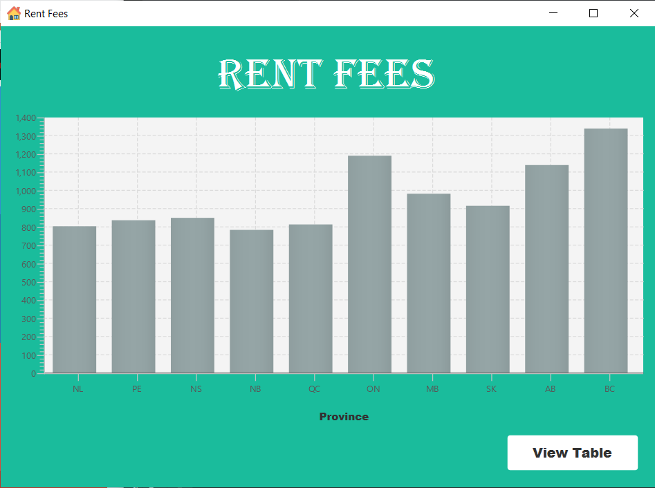

# Rent Fee Report Application

## Overview
This is graphical user interface that allows users to read rent fee of each province from a MySQL database and diplay it is as a chart data

## Technologies
- Java
- JavaFX
- MySQL
- MVC Structure

## Features
- **Chart View**
  - RentFeesView controller takes data from mysql database and display it as a chart through rent-fees-view

- **Table View**
  - RentFeesView controller takes data from mysql database and display it as a table through table-view.fxml

